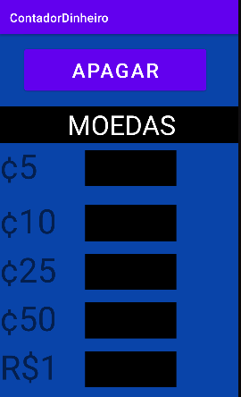
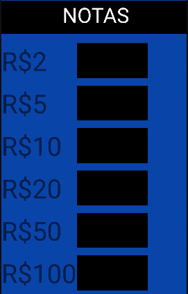

# Contador de Notas e Moedas Mobille - Aplicativo de Treino Mobille

<h1>Necessidade do projeto</h1>
 
O projeto em sí está interligado a necessidade de contagem rapida de moedas e notas, separando o valor total de moedas e de notas, e somando ambos para obter um resultado total do dinheiro inserido

 
 <h1>Recomendações</h1>
 
 <ul><h2>Emuladores preferenciais</h2></ul>
  <li>Android Pixel 5 - Android version 5.1 - Resolution: 1080 x 2280</li>
  <li>Android Pixel 4 - Android version 9.0 - Resolution: 1080 x 2340</li>
 </ul>

 <h1>Linguagens utilizadas</h1>
 <ul>
  <h2>Programação</h2>
  <li>Java</li>
 </ul>
 <ul>
   <h2>Marcação</h2>
 <li>XML</li>
 </ul>

 <h1>Imagens do Programa</li>

 <h2>Programa em tela única</h2>
 <figure>
    
 </figure>
 <figure>
    
 </figure>
 <figure>
    
 </figure>
 <figcaption>
    Tela unica do programa separada em diversas etapas
 </figcaption>

 
